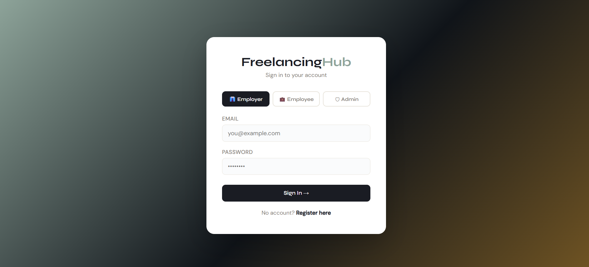
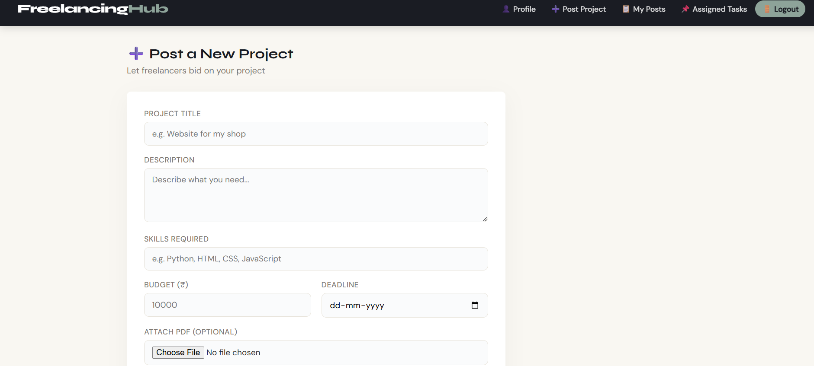
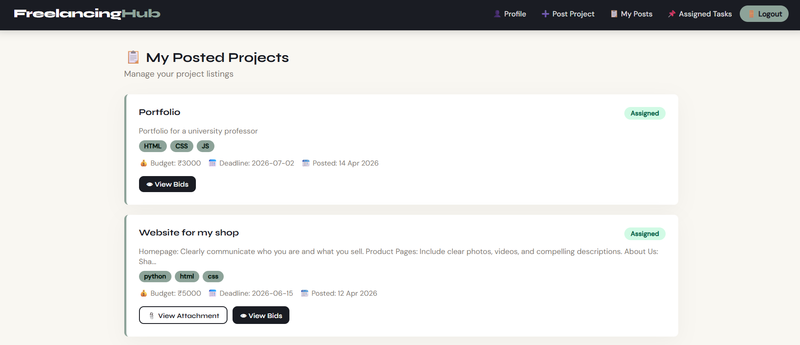
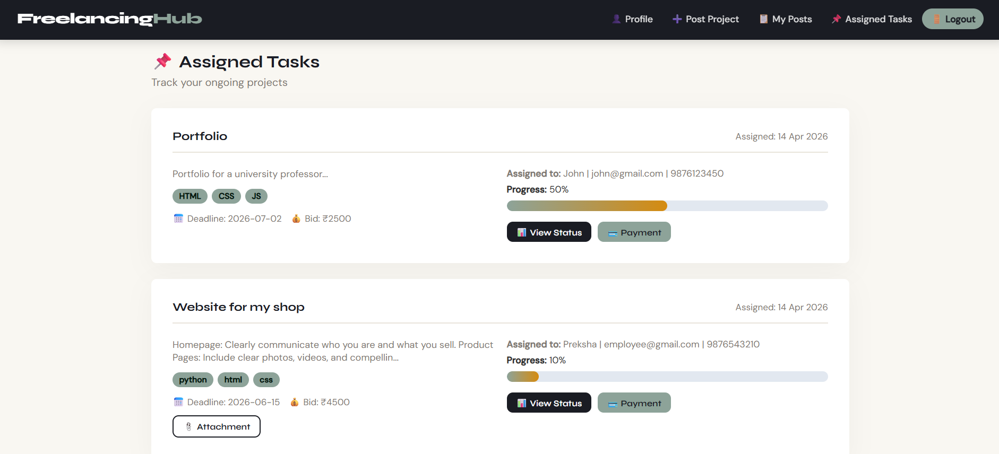
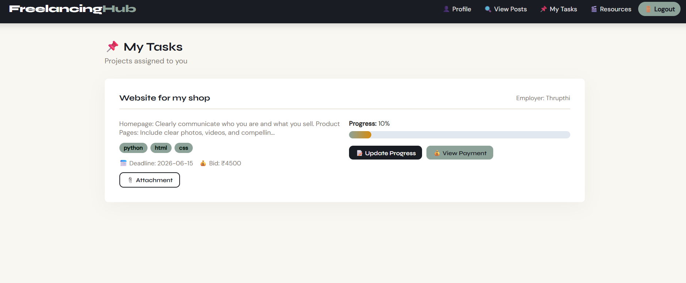
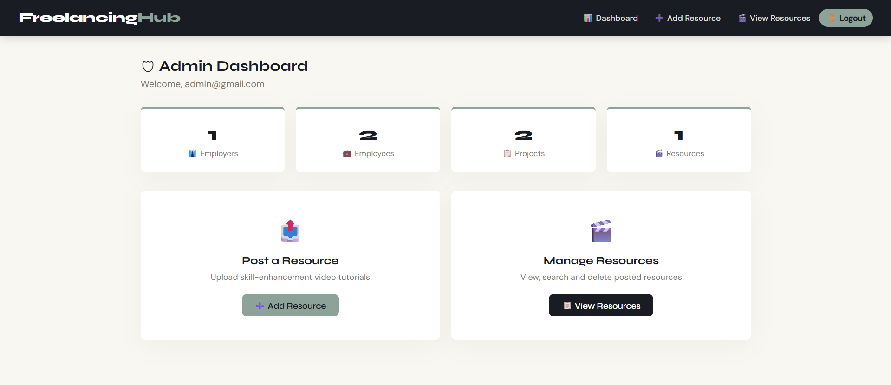

🚀 Freelancer Hub

Freelancer Hub is a full-stack web application that connects employers and freelancers.
It allows users to post projects, bid on tasks, assign work, and track progress through role-based dashboards.

---

📌 Features

🔐 Authentication

- User Registration (Admin, Employer, Freelancer)
- Secure Login & Logout

👤 Profile Management

- View and update profile
- Upload profile photo

💼 Employer Module

- Post new projects
- View posted projects
- Delete projects

👨‍💻 Freelancer Module

- Browse available projects
- Bid on projects
- Search and filter projects

🔄 Bid & Assignment

- View bids
- Assign tasks to freelancers

📊 Task & Progress

- Update task progress
- Track status

💳 Payment Module

- View and manage dummy payments

🛠️ Admin Module

- Manage platform content
- Upload/view/delete tutorials

---

🛠️ Technologies Used

- Frontend: HTML, CSS, JavaScript
- Backend: Python (Flask)
- Database: MySQL
- Tools: Git, GitHub, VS Code

---

📁 Project Structure

freelancer-hub/
│── templates/
│── static/
│── routes/
│── screenshots/
│── app.py
│── config.py
│── requirements.txt
│── README.md

---

⚙️ How to Run

1️⃣ Clone the repository

git clone https://github.com/thrupthi-15/freelancer-hub.git
cd freelancer-hub

2️⃣ Create virtual environment

python -m venv venv

3️⃣ Activate environment

- Windows:

venv\Scripts\activate

- Mac/Linux:

source venv/bin/activate

4️⃣ Install dependencies

pip install -r requirements.txt

5️⃣ Configure database

- Create MySQL database
- Update credentials in "config.py"

6️⃣ Run the app

python app.py

7️⃣ Open browser

http://127.0.0.1:5000/

---

📸 Screenshots

🔐 Login Page

💼 Post Project

📂 Posted Projects

📋 Assigned Task

👨‍💻 Freelancer Task View

🛠️ Admin Page

---

🚀 Future Enhancements

- Real payment integration
- Chat system
- Notifications
- Deployment on cloud

---

🤝 Contribution

Feel free to fork and contribute to this project.

---

📄 License

This project is for educational purposes.

---

---
